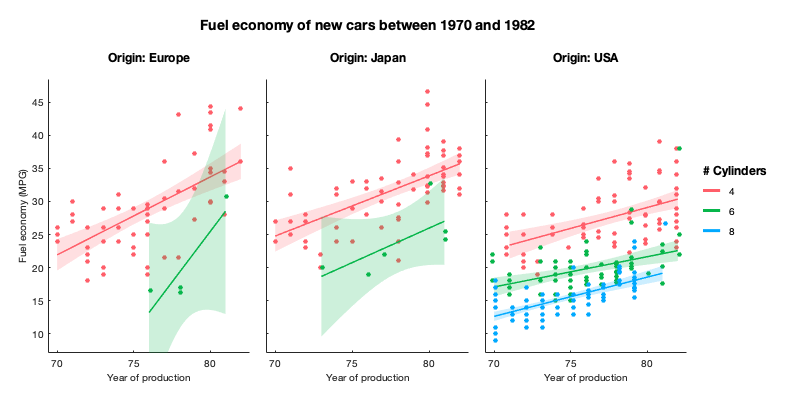
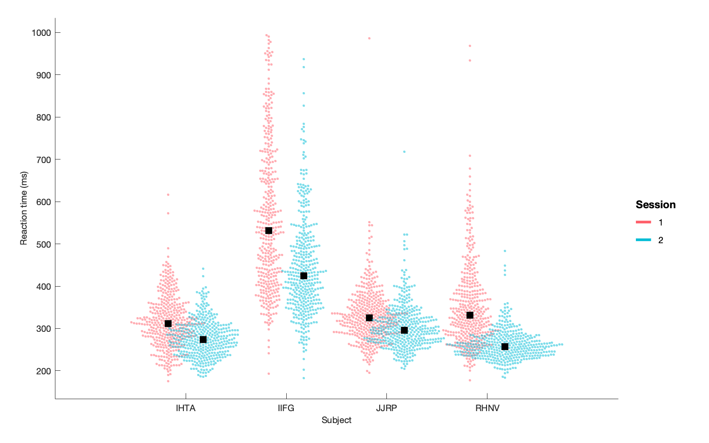
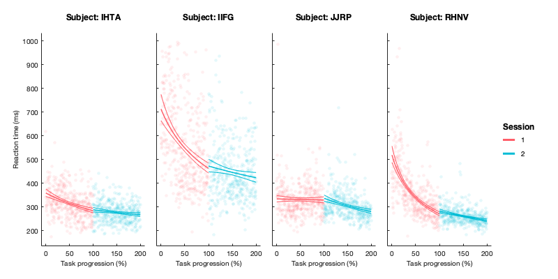
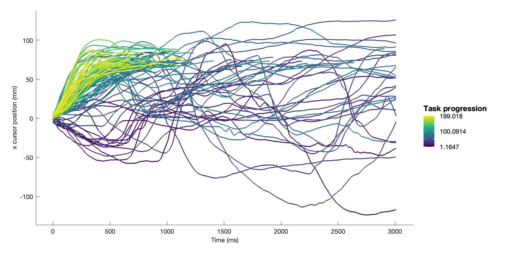
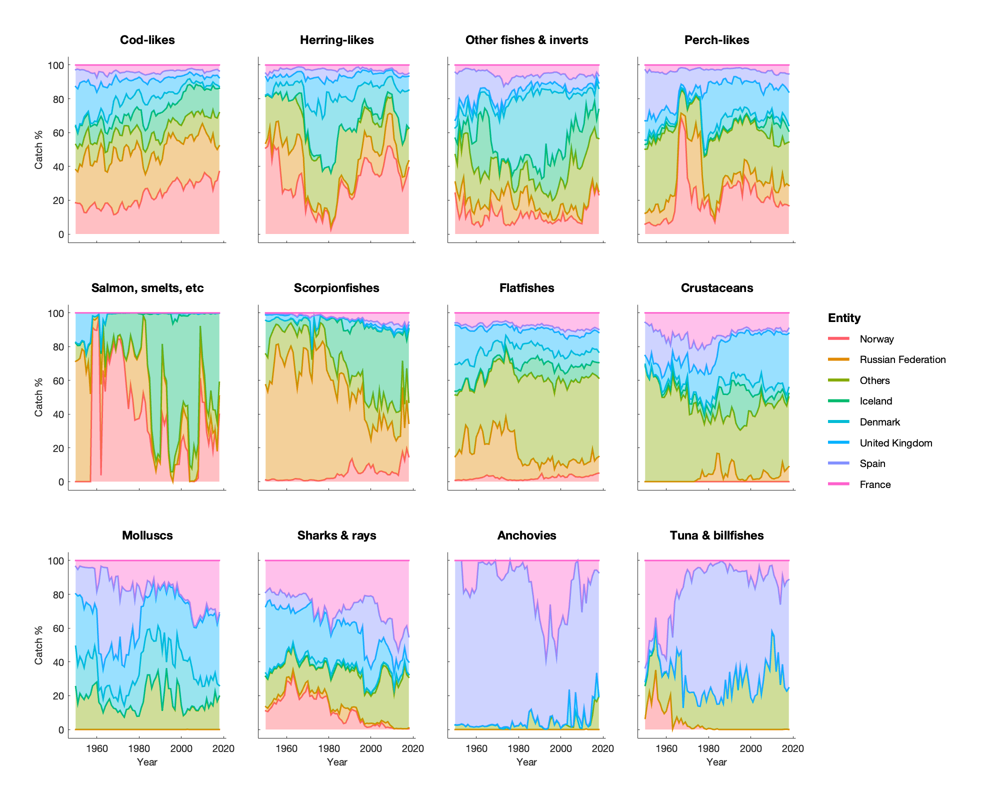
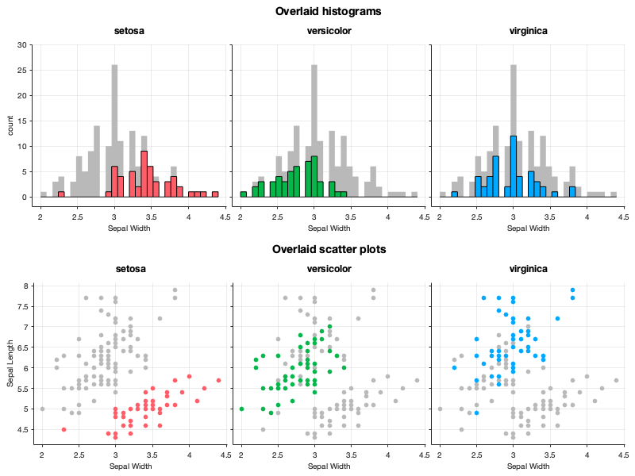
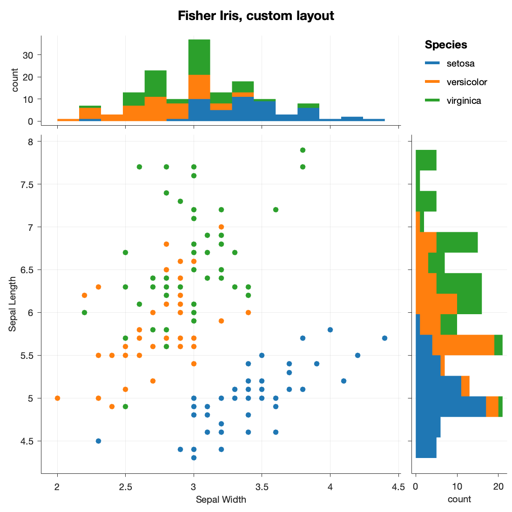
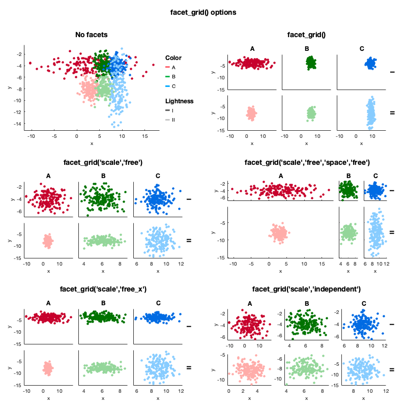
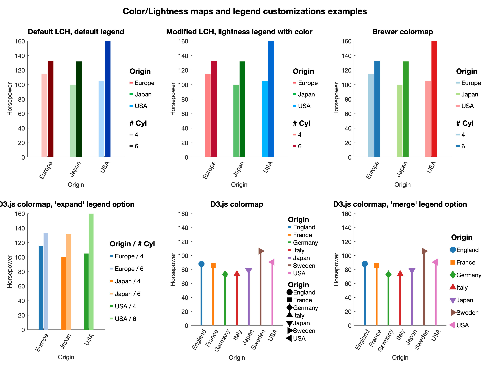

# gramm


 [](https://mathworks.com/matlabcentral/fileexchange/54465-gramm-data-visualization-toolbox)

Gramm is a MATLAB toolbox that enables the rapid creation of complex, publication-quality figures. Its design philosophy focuses on a *declarative* approach, where users specify the desired end result, as opposed to the traditional *imperative* method involving for loops, if/else statements, etc.

The MATLAB implementation of `gramm` is inspired by the "grammar of graphics" principles ([Wilkinson 1999](http://www.springer.com/de/book/9781475731002)) and the [ggplot2](http://ggplot2.tidyverse.org/) library for R by Hadley Wickham. As a reference to this inspiration, gramm stands for **GRAM**mar of graphics for **M**ATLAB. A similar library called [Seaborn](https://seaborn.pydata.org) also exists for Python.

Gramm has been used in many publications from varied fields and is particularily suited for neuroscience, from human movement psychophysics ([Morel et al. 2017](https://doi.org/10.1371/journal.pbio.2001323)), to electrophysiology ([Morel et al. 2016](https://doi.org/10.1088/1741-2560/13/1/016002); [Ferrea et al. 2017](https://doi.org/10.1152/jn.00504.2017)), human functional imaging  ([Wan et al. 2017](https://doi.org/10.1002/hbm.23932)) and animal training ([Berger et al. 2017](https://doi.org/10.1152/jn.00614.2017)).

- [Demo live scripts](#demo-live-scripts)
- [Workflow](#workflow)
- [About gramm](#about-gramm)
  - [Installation](#Installation)
  - [Documentation](#Documentation)
  - [Citing gramm](#citing-gramm)
- [Features](#features)
- [Gallery](#gallery)

## Demo live scripts ##
Typical use cases are described in these live scripts. We recommend opening the live scripts in MATLAB to benefit from interactive elements. A simplified workflow is presented below this table.

To run the files in Matlab online, you will need to add the gramm folder to your path (select the gramm folder in the files panel on the left, right click>Add to Path>Selected Folder(s)).

- **Getting Started:**

 &emsp; [👀 Preview](http://htmlpreview.github.io/?https://github.com/piermorel/gramm/blob/master/gramm/html/GettingStarted.html)&emsp;[](https://matlab.mathworks.com/open/github/v1?repo=piermorel/gramm&file=gramm/doc/GettingStarted.mlx)

- **Explore grouped data:**

&emsp; [👀 Preview](http://htmlpreview.github.io/?https://github.com/piermorel/gramm/blob/master/gramm/html/Groups.html)&emsp;[](https://matlab.mathworks.com/open/github/v1?repo=piermorel/gramm&file=gramm/doc/Groups.mlx)

- **Explore X/Y data:**

 &emsp;[👀 Preview](http://htmlpreview.github.io/?https://github.com/piermorel/gramm/blob/master/gramm/html/XY.html) &emsp;[](https://matlab.mathworks.com/open/github/v1?repo=piermorel/gramm&file=gramm/doc/XY.mlx)


- **Explore Time Series data:**

&emsp;[👀 Preview](http://htmlpreview.github.io/?https://github.com/piermorel/gramm/blob/master/gramm/html/TimeSeries.html) &emsp;[](https://matlab.mathworks.com/open/github/v1?repo=piermorel/gramm&file=gramm/doc/TimeSeries.mlx)

- **Explore table data from an open dataset hosted on S3:**

&emsp;[👀 Preview](http://htmlpreview.github.io/?https://github.com/piermorel/gramm/blob/master/gramm/html/OnlineTable.html) &emsp;[](https://matlab.mathworks.com/open/github/v1?repo=piermorel/gramm&file=gramm/doc/OnlineTable.mlx)

- **Advanced examples:**

&emsp;[👀 Preview](http://htmlpreview.github.io/?https://github.com/piermorel/gramm/blob/master/gramm/html/examples.html)&emsp;[](https://matlab.mathworks.com/open/github/v1?repo=piermorel/gramm&file=gramm/doc/examples.mlx)


## Workflow

The typical workflow to generate this figure with only 7 lines of code is detailed in the ["Getting Started" live script.](#demo-live-scripts). The figure uses data from the <code>carbig</code> dataset and represents the evolution of fuel economy of new cars with time, depending on the number of cylinders indicated by color, and regions of origin separated across subplot columns.


Here are the main steps to generate this figure:
1. Provide gramm with the relevant data for the figure: X and Y variables, but also the variables that will determine color, subplot rows/columns, etc.
```matlab
load example_data.mat %Load example dataset about cars

% Create a gramm object g, provide x (year of production) and y (fuel economy) data,
% color grouping data (number of cylinders) and select a subset of the data (even numbers of cylinders)
g=gramm('x',cars.Model_Year,'y',cars.MPG,'color',cars.Cylinders,...
    'subset',~mod(cars.Cylinders,2);
% Subdivide the data in subplots horizontally by region of origin
g.facet_grid([],cars.Origin_Region);
```
2. Add graphical layers to your figure: raw data layers (directly plot data as points, lines...) or statistical layers (fits, histograms, densities, summaries with confidence intervals...). One instruction is enough to add each layer, and all layers offer many customization options.
```matlab
 % Plot raw data as points with a small horizontal offset between groups
g.geom_point("dodge",0.5);
% Plot linear fits of the data
g.stat_glm(); 
```
3. Optionally configure legends, title and adjust the look the figure (colors, axes, etc.)
```matlab
% Set appropriate names for legends
g.set_names('column','Origin', 'x','Year of production', 'y','Fuel economy (MPG)',...
    'color','# Cylinders');
%Set figure title
g.set_title('Fuel economy of new cars between 1970 and 1982');
```
4. Draw the figure, gramm takes care of all the annoying parts: no need to loop over colors or subplots, colors and legends are generated automatically, axes limits are taken care of, etc.
```matlab
g.draw();
```


## About gramm ##

### Installing gramm ###

We recommend installing gramm directly through MATLAB's Add-ons explorer. Search for "gramm" and click Add!

You can also install gramm manually by downloading the latest .mltbx file or by adding the gramm folder from the repository to your path.

### Documentation ###

Once the toolbox is installed, type ```doc``` in the MATLAB command window and you will see gramm in the "Supplemental Software" section at the bottom of the left navigation bar. From there you will have access to several live script demos and a cheat sheet with all commands in a compact format.

### Citing gramm ###

Gramm has been published in the Journal of Open Source Software. If you use gramm plots in a publication you can thus cite it using the following:

[](https://doi.org/10.21105/joss.00568)

Morel, (2018). Gramm: grammar of graphics plotting in Matlab. Journal of Open Source Software, 3(23), 568, https://doi.org/10.21105/joss.00568

### Compatibility ###

 Recent versions of gramm (3.0 and above) target MATLAB above R2018b. Older releases work in older MATLAB versions. The statistics toolbox is required for some methods: <code>stat_glm()</code>, some <code>stat_summary()</code> methods, <code>stat_density()</code>. The curve fitting toolbox or the statistics toolbox is required for <code>stat_fit()</code>.


## Main Features
- Accepts X, Y, Z and grouping data in varied types and shapes (arrays, matrices, cells)

- Multiple ways of separating groups of data:
  - Colors, lightness, point markers, line styles, and point/line size (<code>'color'</code>, <code>'lightness'</code>, <code>'marker'</code>, <code>'linestyle'</code>,  <code>'size'</code>)
  - Subplots by row and/or columns, or wrapping columns (<code>facet_grid()</code> and <code>facet_wrap()</code>). Multiple options for consistent axis limits across facets, rows, columns, etc. (using <code>'scale'</code> and <code>'space'</code>)
  - Separate figures (<code>fig()</code>)

- Multiple ways of directly plotting the data:
  - scatter plots (<code>geom_point()</code>) and jittered scatter plot (<code>geom_jitter()</code>)
  - lines (<code>geom_line()</code>)
  - pre-computed confidence intervals (<code>geom_interval()</code>)
  - bars plots (<code>geom_bar()</code>)
  - raster plots (<code>geom_raster()</code>)
  - labels (<code>geom_label()</code>)
  - point counts (<code>geom_count()</code>)
  - swarm / beeswarm plots (<code>geom_swarm()</code>)
  - text labels (<code>geom_label()</code>)

- Multiple statistical visualizations on the data:
  - y data summarized by x values (uniques or binned) with confidence intervals (<code>stat_summary()</code>)
  - histograms and density plots of x values (<code>stat_bin()</code> and <code>stat_density()</code>)
  - box and whisker plots (<code>stat_boxplot()</code>)
  - violin plots (<code>stat_violin()</code>)
  - quantile-quantile plots (<code>stat_qq()</code>) of x data distribution against theoretical distribution or y data distribution.
  - Smoothed data (<code>stat_smooth()</code>)
  - 2D binning (<code>stat_bin2d()</code>)
  - GLM fits (<code>stat_glm()</code>, requires statistics toolbox)
  - Custom fits with user-provided anonymous function (<code>stat_fit()</code>)
  - Ellipses of confidence (<code>stat_ellipse()</code>)

- Easy export in multiple formats with a convenient <code>export()</code> method that can be called after <code>draw()</code> and maintains correct dimensions/aspect ratio. 
- All visualizations have plenty of options accessible through arguments, from computational to esthetic ones.
- Representation of groupings can be fully customized (colormaps, ordering)
- Multiple gramm plots can be combined in the same figure by creating a matrix of gramm objects and calling the <code>draw()</code> method on the whole matrix.
- MATLABs axes properties are modifiable through the method <code>axe_property()</code>
- Non-data graphical elements can be added such as reference lines or polygons (<code>geom_abline()</code>, <code>geom_vline()</code>,<code>geom_hline()</code>,<code>geom_polygon()</code>)
- For advanced customization, handles of all graphic elements and computation results are easily available after the <code>draw()</code> through the <code>results</code> structure of the gramm object


## Gallery

All these examples are from the [advanced examples live scripts](#demo-live-scripts)

### Superimposition of gramm objects on the same axes


### Custom layouts ###



### Grid and scaling options ###



### Colormap and legend options ###



## Acknowledgements
gramm was inspired and/or used code from:
- [ggplot2](http://ggplot2.org)
- [Panda](http://www.neural-code.com/index.php/panda) for color conversion
- [subtightplot](http://www.mathworks.com/matlabcentral/fileexchange/39664-subtightplot) for subplot creation
- [colorbrewer2](http://colorbrewer2.org)
- [viridis colormap](https://bids.github.io/colormap/)
