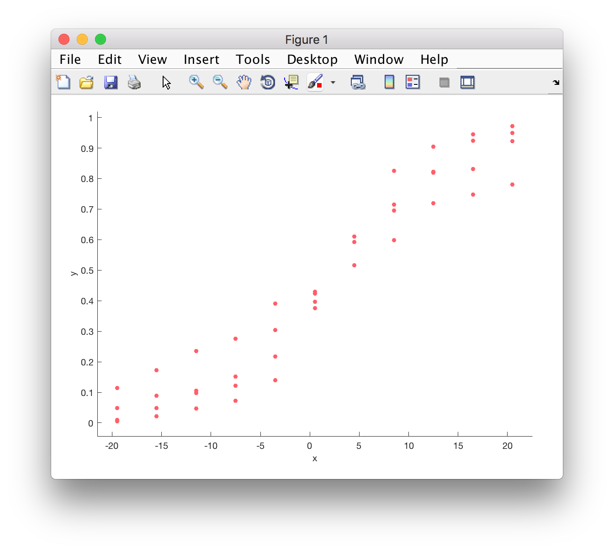

# Getting started

## Basics

Gramm is a Matlab toolbox which allows the quick creation of complex, publication-quality figures in Matlab. One of the main design philosophies is to allow users to make plots by specifying the desired end result. This *declarative* approach is quite different from what you might be used to: specifying the steps, in an *imperative* way, to assemble a plot or visualisation.

If you haven't come across this particular set of ideas yet, it might seem a bit strange. But you will soon come to appreciate how powerful and versatile it can be for exploring data and quickly changing how things are presented.

The Matlab implementation of ``gramm()`` is inspired by the [ggplot2](http://ggplot2.org) library for ``R`` by [Hadley Wickham](http://had.co.nz).

For an excellent introduction to the general ideas, have a look at the paper *"A layered grammar of graphics"*  [[PDF]](http://vita.had.co.nz/papers/layered-grammar.pdf). If you are really keen, you can also check out Leland Wilkinson's original book [The Grammar of Graphics](https://www.cs.uic.edu/~wilkinson/TheGrammarOfGraphics/GOG.html) that laid the foundation for much of this work.

## Getting to grips with GRAMM

### Download and install

If you are running MacOS, Linux or another Unix var, you can simply get the most up-to-date version by ``git clone``:

```bash
cd ~/matlab # or your favourite place to keep code
git clone https://github.com/piermorel/gramm.git
```

If you are on Windows, or if you don't have a ``git`` client, you can alternatively download the .zip archive and unpack that.

Finally, in Matlab, you also need to add the toolbox to your path. A nice, reproducible way to to this is to add the following lines to your ``startup.m`` file

```matlab
addpath(genpath('~/matlab/gramm/'))
```

If you have done this correctly, then on restarting Matlab (or after running ``startup()``) you should be able to call up the documentation by ``doc gramm``


### A first plot

To start out, let's just plot a simple scatter plot - but the GRAMM way.

First clear up your workspace and load in the sample data from a standard psychophysics experiment (details below if you are interested)

```matlab
% close all figures clear workspace
close all, clear all

% load some sample data (psychophysics)
load('getting_started_data.mat')

% look at variables...
whos

%  Name           Size            Bytes  Class ...
%
%  data          44x4              1408  double
%  data_key       1x4               502  cell
```
The data are organised in a way that's quite commonly used for plotting these kinds of results:
  - the first column contains the a stimulus parameter. In this case this is the direction of the stimulus, which was manipulated systematically during the experiment. **independent variable**.

  - the second column contains the proportion of times the subject gave a particular response (accumulated over many trials). **dependent variable**.

  - 3rd and 4th columns contain the standard error and another stimulus parameter (that caputures signal "strength") - but let's ignore these for now

One of the main ideas of the *grammar of graphics* is that every plot or visualisation is made up of many different elements that can be combined to form.


The three basic elements in this scheme are (1) *data*, (2) *aesthetics*, and (3) *geometry*. The *data* refer the numbers / information you want to display. The *aesthetics* are the properties of the graph that you want to map these data to: this could be the x/y position of a point or line segment, the colour, line thickness, and so on. And finally, the *geometry* indicates whether you want to use points, lines, polygons, etc.

So let's apply these ideas here:

a. We create a `gramm` object and decide on how we want to map **data** to **aeshetics**. `gramm` is designed in an object-oriented way, so the next few lines might look odd - but the pattern will become familiar very quickly:

```matlab
% we first need to create a GRAMM object
g = gramm('x', data(:,1), 'y', data(:,2))
```

This means: create a gramm object (which will be assiged to `g`). The `data(:,1)`, first column of data will be mapped to the `x`-aesthetic, the second column to the `y`-aesthetic.

When you execute this line of code, nothing appears to happen, but if you inspect the workspace, the variable `g` has been created.

b. Now we add the `geometry` we would like to display this information with by calling the method `geom_point()` on the object `g`. As a final step, we actually need to also explicity call for the figure to be drawn. This may seem like a drag, but actually it's very useful because it will allow us to stack up calls and make more complicated figures later...

```matlab
% use points
g.geom_point()

% and actually draw
g.draw()
```
> A note here: `g.geom_point()` is equivalent to `geom_point(g)`, but the dot notation makes it much more explicit, that this `geom_point()` method belongs to the object `g`. It's also more readable.



### Adding a layer of complexity

The 4th column of our `data` variable actually contains information about which conditions the behavioural data were acquired under. Really, we want to *group* the data according to which condition they were in.

```matlab
% what were the stimulus conditions?
unique(data(:,4))

%   0.0400
%   0.0700
%   0.1300
%   0.2500
```
There happen to be four different "levels" (actually the number specifies the coherence of the stimulus... which captures how strong the motion signal was).

Let's make two small tweaks to our first plot:

```matlab
% add color as an aesthetic
g = gramm('x', data(:,1), 'y', data(:,2), 'color', data(:,4))

% and use geom_line() as well geom_point()
g.geom_point()
g.geom_line()
g.draw()
```


Et voilà. `gramm` has used this additional aesthetic, *color*, to group the data by condition, made the correct line plots, and has even added a legend to help us interpret the plot.

Even in this simple example, you should be able to appreciate the power of using this *declarative* approach and using layers to build up your plot.

An additional bonus is that the plot is much closer to publication-quality than the Matlab defaults. A quick way to see how "clean" the plot is is to save it out to svg format. The graphics file that's output is scalable, renders nicely in a web browser (try dragging it into Chrome), and can easily be edited in Illustrator, Inkscape or another vector graphics program.

```matlab
% output to SVG format
print(gcf(), '-dsvg', 'figure_1.svg')
```


## A couple of details about the sample data

[to be completed]
